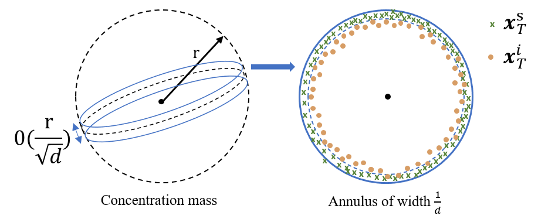

# BoundaryDiffusion

Ye Zhu, Yu Wu, Zhiwei Deng, Olga Russakovsky, Yan Yan

This is the official Pytorch implementation of the paper **[Boundary Guided Learning-Free Semantic Control with Diffusion Models](https://arxiv.org/abs/2302.08357)** (NeurIPS 2023). 


[Paper](https://arxiv.org/abs/2302.08357) | [Project Page](https://l-yezhu.github.io/BoundaryDiffusion/)


### Updates:

- Camera-ready version available!

- (09/2023) We have verified in our following experiments, the **BoundaryDiffusion** method is also applicable to latent diffusion models (StableDiffusion).

- (09/2023) Our *BoundaryDiffusion* paper accepted to **NeurIPS 2023**! Code released, and some ready-to-use boundaries are provided! Check *Section 5 Semantic Boundary Search*.


 

Please find our **randomly selected, non-cherry-picked** results comparison with several learning-based state-of-the-art methods (Asyrp[ICLR23], DiffusionCLIP[CVPR22]) for the image semantic editing task below, usin **unconditionally** trained denoising diffusion probablistic models (DDPMs).

<p align="center">
    


## 1. Take-away

Our *BoundaryDiffusion* features the one of the first **learning-free** diffusion editing work with **unconditionally** pre-trained frozen DDPMs, which is a light-weight, effecient and resource-friendly method with strong state-of-the-art (SOTA) performance. The contributions of our work come from three high-level perspectives in terms of analytical, technical and experimental aspects, detailed as below:

a). From the perspective of *diffusion latent space understanding and analysis*, we explicitly demonstrate that **unconditional** diffusion generative models (thus  w/o any semantic supervision in training), already exhibit meaningful semantic subspaces **in the generic level** with clear boundaries. In addition, we formulate the mixing step problem (analog to the mixing time studies in the Markov chain from mathematics) for diffusion models to characterize the forming process of such semantic subspaces in a theoretically supported way, and propose an automatic approach to search for it.

b). From the perspective of *methodology design*, we introduce a novel **learning-free** method that allows for efficient and effective semantic control with **pre-trained and frozen** denoising diffusion models in **one-step operation** at the previously found mixing step, by guiding the denoising trajectory to cross the target semantic boundary.

c). From the perspective of *experiments*, we conduct extensive experiments using different base diffusion architectures (DDPM, iDDPM), multiple datasets (CelebA, CelebA-HQ, LSUN-church, LSUN-bedroom, AFHQ-dog) and image resolutions (64, 256), achieving **SOTA performance** compared to other learning-based methods.


## 2. Theoretical Analysis of Diffusion Models

Our methodology design in this work is based on the analysis of high-dimensional latent spaces of the pre-trained denoising diffusion models. Specifically, we propose to study the probablistic and geometric properties of latent spaces given differnt sources of latent encodings (i.e., sampling vs. inversion), and observe that the inverted latent encodings do not follow the standard Gaussian distribution in the departure latent space as for the directly sampled ones.


 <p align="center">
    


Our theoretical analysis also introduces the concept of **Mixing Step** to characterize the convergence of pre-trained diffusion models, inspired by the **Markov mixing time** study.
Please refer to our paper for more details.


## 3. Environment Setup
We have similar environment setup as in [DiffusionCLIP](https://github.com/gwang-kim/DiffusionCLIP), using Python3, Anaconda, GPUs, CUDA, and CuDNN. 
While our proposed semantic boundary search and mixing trajectory methods are very light-weighted, GPUs are still needed to run the pre-trained DDMs.
To setup the environment, you can follow the instructions below:

```
conda create --name bdiff python=3.8
source activate bdiff
# install the pytorch and cudatoolkit based on your machine.
conda install pytorch==1.8.0 torchvision==0.9.0 torchaudio==0.8.0 cudatoolkit=11.1 -c pytorch -c conda-forge
git clone https://github.com/L-YeZhu/BoundaryDiffusion.git
cd BoundaryDiffusion
pip install -r requirements.txt
```


## 4. Pre-trained Diffusion Models and Datasets

Our method works on pre-trained diffusion models. Note that the pre-trained models are automatically downloaded in the code adapted from [DiffusionCLIP](https://github.com/gwang-kim/DiffusionCLIP).

| Image Type to Edit |Size| Pretrained Model | Dataset | Reference Repo. 
|---|---|---|---|---
| Human face |256×256| Diffusion (Auto), [IR-SE50](https://drive.google.com/file/d/1KW7bjndL3QG3sxBbZxreGHigcCCpsDgn/view) | [CelebA-HQ](https://arxiv.org/abs/1710.10196) | [SDEdit](https://github.com/ermongroup/SDEdit), [TreB1eN](https://github.com/TreB1eN/InsightFace_Pytorch) 
| Church |256×256| Diffusion (Auto) | [LSUN-Bedroom](https://www.yf.io/p/lsun) | [SDEdit](https://github.com/ermongroup/SDEdit) 
| Bedroom |256×256| Diffusion (Auto) | [LSUN-Church](https://www.yf.io/p/lsun) | [SDEdit](https://github.com/ermongroup/SDEdit) 
| Dog face |256×256| [Diffusion](https://drive.google.com/file/d/14OG_o3aa8Hxmfu36IIRyOgRwEP6ngLdo/view) | [AFHQ-Dog](https://arxiv.org/abs/1912.01865) | [ILVR](https://github.com/jychoi118/ilvr_adm)
<!-- | ImageNet |512×512| [Diffusion](https://openaipublic.blob.core.windows.net/diffusion/jul-2021/512x512_diffusion.pt) | [ImageNet](https://image-net.org/index.php) | [Guided Diffusion](https://github.com/openai/guided-diffusion) -->

If you want to use **real source images**, for [CelebA-HQ](https://drive.google.com/drive/folders/0B4qLcYyJmiz0TXY1NG02bzZVRGs?resourcekey=0-arAVTUfW9KRhN-irJchVKQ), and [AFHQ-Dog](https://github.com/clovaai/stargan-v2), you can use following code:    
```
# CelebA-HQ 256x256
bash data_download.sh celeba_hq .

# AFHQ-Dog 256x256
bash data_download.sh afhq .
```


## 5. Semantic Boundary Search

We adopt the linear SVM to search for the semantic boundary on different latent space levels. To define the boundaries, we need images with semantic attribute annotations. We use the CelebA-HQ-256 dataset as an example, in which the dataset contains the annotations for 40 different attributes.
The following command edit the smiling attribute and use the real images from CelabA-HQ to search for the semantic boundary, and automatically stores two hyperplanes in the folder `./boundary/`.

```
python main.py --boundary_search --config celeba.yml --exp ./runs/test --edit_attr smiling --n_train_img 100 --n_test_img 100  --n_iter 1  --t_0 500  --n_inv_step 40 --n_train_step 1  --n_test_step 40
```

**Note:** To search for a good and well-define boundary, we may need to adjust the number of image samples used according to different attribute characteristics. An indicator for the semantic boundary is the classification accuracy for the test split.

**Pre-localized boundaries:** We provide some pre-localized boundaries for easy use. For instance, for iDDPM trained on human faces, here is an example of [smile attribute at z space](https://drive.google.com/file/d/11Q2OW-g2OHE9Tr8_kNMjfezsr_WJI-nS/view?usp=sharing) and [smile attribute at h space](https://drive.google.com/file/d/1Oz71CmhtCg4RR87GEQuNqyxRzXhecw0W/view?usp=sharing). Another semantic boundary based on the text prompt ```red brick wall church``` at [z space](https://drive.google.com/file/d/1V-bjFVgH1LaA4oppKdftpCia-Abm3gKS/view?usp=sharing) or at [h space](https://drive.google.com/file/d/11MPuP0sm257tMcAfXPxwgfd-CliNWmCm/view?usp=sharing).


## 6. Mixing Trajectory for Semantic Control
After having identified the boundaries, we can now guide the denoising trajectory using the editing distance.

### 6.1 Real-image conditioned semantic control
For real-image conditioned semantic control, you can run the following command:
```
python main.py --edit_image_boundary --config celeba.yml --exp ./runs/test --t_0 500 --n_inv_step 40 --n_test_step 40 --n_iter 1 --img_path imgs/celeb2.png --boundary_h 'path/to/target_boundary_h' --boundary_z 'path/to/target_boundary_z' --start_distance -150 --end_distance 150 --edit_img_number 20
```

The above commond will edit the given image on the editing distance defined by the `start_distance` and `end_distance` to the target boundary, and will output ```edit_img_number``` images with gradual editing effects.

### 6.2 Unconditional semantic control
For the unconditional scenario, you can also control the generated sample to possess certain attribute features. The main difference between unconditional and conditional is the source of depature latent encodings.
The following command generates images with binary attribute given the same boundaries as in previous case.
```
python main.py --unconditional --config celeba.yml --exp ./runs/unconditional --n_inv_step 200
```

### 6.3 Text-conditioned semantic control
For text-conditioned semantic control, you will need to first generate some synthetic images using other existing text-to-image models, and then repeat the boundary search and mixing trajectory process above.

   


## 7. Citation

If you find our work interesting and useful, please consider citing it.
```
@inproceedings{zhu2023boundary,
  title={Boundary Guided Learning-Free Semantic Control with Diffusion Models},
  author={Zhu, Ye and Wu, Yu and Deng, Zhiwei and Russakovsky, Olga and Yan, Yan},
  booktitle={Conference on Neural Information Processing Systems (NeurIPS)},
  year={2023}
}
```


## 8. Acknowledgement

We would like to thank the authors of previous related projects for generously sharing their code, especially the [DiffusionCLIP](https://github.com/gwang-kim/DiffusionCLIP), from which our code is adapted. I would like also personally thank my math professor Alain CHILLÈS for insightful discussions on the theoretical analysis. 


### References

[1] Kwon, Mingi, Jaeseok Jeong, and Youngjung Uh. “Diffusion models already have a semantic latent space.” In ICLR 2023.

[2] Kim, Gwanghyun, Taesung Kwon, and Jong Chul Ye. “Diffusionclip: Text-guided diffusion models for robust image manipulation.” In CVPR. 2022.

[3] Preechakul, Konpat, Nattanat Chatthee, Suttisak Wizadwongsa, and Supasorn Suwajanakorn. “Diffusion autoencoders: Toward a meaningful and decodable representation.” In CVPR. 2022.

[4] Song, Jiaming, Chenlin Meng, and Stefano Ermon. “Denoising diffusion implicit models.” In ICLR 2021.

[5] Ho, Jonathan, Ajay Jain, and Pieter Abbeel. “Denoising diffusion probabilistic models.” In NeurIPs 2020.

[6] Nichol, Alexander Quinn, and Prafulla Dhariwal. “Improved denoising diffusion probabilistic models.” In ICML, 2021.


<!-- ## 1. Project Overview
In this work, we present a **learning-free** method for applying pre-trained Denoising Diffusion Models (DDMs) on semantic control and image manipulation in **one single-step operation**. Speficically, we propose to guide the denoising trajectory to across the target semantic boundary to achieve the image editing purpose. It is worth noting that the semantic boundaries are formed during the training process of diffusion models, and our method **do not need to fine-tune or learning any extra editing neural network modules**, allowing for very efficient and light-weighted downstream applications.

<p align="center">
    


## 2. Theoretical Analysis of Diffusion Models

Our methodology design in this work is based on the analysis of high-dimensional latent spaces of the pre-trained denoising diffusion models. Specifically, we propose to study the probablistic and geometric properties of latent spaces given differnt sources of latent encodings (i.e., sampling vs. inversion), and observe that the inverted latent encodings do not follow the standard Gaussian distribution in the departure latent space as for the directly sampled ones.


 <p align="center">
    


Our theoretical analysis also introduces the concept of **Mixing Step** to characterize the convergence of pre-trained diffusion models, inspired by the **Markov mixing time** study.
Please refer to our paper for more details.
 -->
