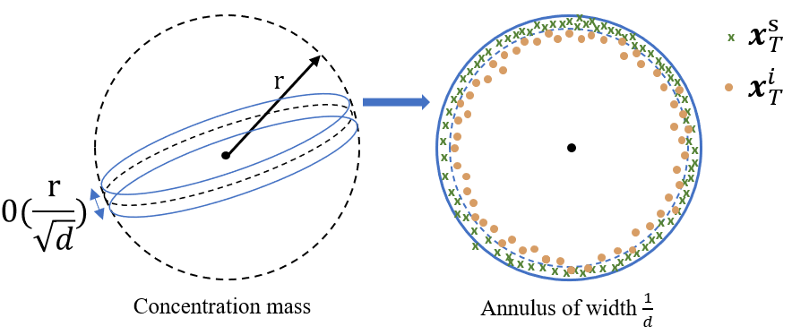
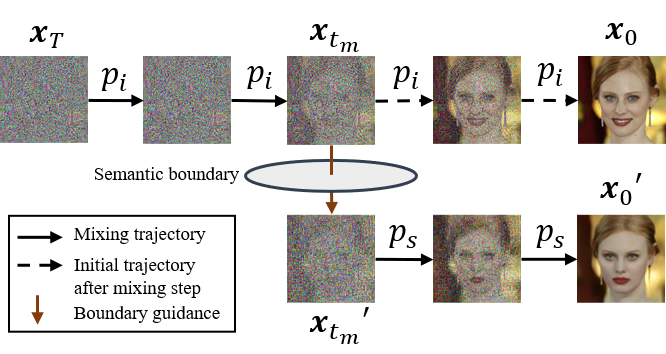

# BoundaryDiffusion

This is the official Pytorch implementation of the paper **[Boundary Guided Mixing Trajectory for Semantic Control with Diffusion Models](https://arxiv.org/abs/2302.08357)**. We will release the full code later, stay tuned!


Please find our **randomly selected, non-cherry-picked** results comparison with several learning-based state-of-the-art methods (Asyrp[ICLR23], DiffusionCLIP[CVPR22]) for the image semantic editing task below, using <**unconditionally** trained denoising diffusion probablistic models (DDPMs).

<p align="center">
    


## 1. Take-away

Our *BoundaryDiffusion* features the oen of the first **learning-free** diffusion editing work with **unconditionally** pre-trained frozen DDPMs, which is a light-weight, effecient and resource-friendly method with strong state-of-the-art (SOTA) performance. The contributions of our work come from three high-level perspectives in terms of analytical, technical and experimental aspects, detailed as below:

a). From the perspective of *diffusion latent space understanding and analysis*, we explicitly demonstrate that **unconditional** diffusion generative models (thus  w/o any semantic supervision in training), already exhibit meaningful semantic subspaces **in the generic level** with clear boundaries. In addition, we formulate the mixing step problem (analog to the mixing time studies in the Markov chain from mathematics) for diffusion models to characterize the forming process of such semantic subspaces in a theoretically supported way, and propose an automatic approach to search for it.

b). From the perspective of *methodology design*, we introduce a novel **learning-free** method that allows for efficient and effective semantic control with **pre-trained and frozen** denoising diffusion models in **one-step operation** at the previously found mixing step, by guiding the denoising trajectory to cross the target semantic boundary.

c). From the perspective of *experiments*, we conduct extensive experiments using different base diffusion architectures (DDPM, iDDPM), multiple datasets (CelebA, CelebA-HQ, LSUN-church, LSUN-bedroom, AFHQ-dog) and image resolutions (64, 256), achieving **SOTA performance** compared to other learning-based methods.

## 2. Problem Overview

Denoising Diffusion Probabilistic Models (DDPMs) have become the mainstream approach in the generative field for synthesizing high-quality images. The core problem in image generation is about learning a probabilistic model that captures the real data distribution. 

owever, despite the impressive performance in image synthesis (distribution mapping), diffusion generative models are usually considered to be less semantic-aware (semantic understanding), especially in the case of **unconditionally trained DDPMs** without semantic supervision in the generic space along the denoising chain (in contrast to the *h*-space discussed in [1]).

The above finding suggests critical properties of DDPMs in terms of model understanding and allows for multiple downstream tasks with pre-trained models, such as the semantic control and manipulation we experiment with in this work.


## 3. High-Dimensional Latent Spaces Analysis

A better understanding of the high-dimensional latent spaces along the Markov chain is critical to interpret and utilize the diffusion models, therefore, we propose to start this work by presenting novel theoretical and empirical analysis.

Unlike existing understanding of the stochastic denoising and deterministic inversion, which believes the two directions form a symmetric trajectory [1,2]. We demonstrate that the two processes are asymmetric, geometrically illustrated below, where the inverted latent encodings no long follow a standard Gaussian, in contrast to the directly sampled ones.

 <p align="center">
    


The above finding reveals the *distance effect* that impairs the quality of final synthesized images, when directly imposing an editing signal (*i.e.,* a distance shift in the high-dimensional space) on the inverted latent encodings from given real images.

We then propose to study the convergence along the Markov chain, which features a critical diffusion step where we should edit the latent encoding to achieve the semantic control.

## 4. *BoundaryDiffusion* Method

Our proposed *BoundaryDiffusion* method consists of two steps: fitting semantic boudaries, and mixing trajectory.

We use SVMs to fit the semantic boundary in the form of hyperplanes, and then to guide the original denoising trajectory to cross the target boundary at the critical mixing step.


 <p align="center">
    


## 5. Experiments for Semantic Control

 We conduct extensive experiments on three semantic manipulation tasks: *real image conditioned semantic editing*, *real image conditioned text-based editing*, and *unconditional image synthesis with semantic control*, on CelabA-HQ, LSUN-Church, LSUN-Bedroom, AFHQ-Dog datasets using different model architectures (DDPMs [5], improved DDPMs[6]), achieving **state-of-the-art performance** compared to the learning-based methods [1,2], with negligible boundary search time (~1s), and without changing any parameters from the pre-trained base model.         


## 6. Citation

If you find our work interesting and useful, please consider citing it.
```
@article{zhu2023boundary,
  title={Boundary Guided Mixing Trajectory for Semantic Control with Diffusion Models},
  author={Zhu, Ye and Wu, Yu and Deng, Zhiwei and Russakovsky, Olga and Yan, Yan},
  journal={arXiv preprint arXiv:2302.08357},
  year={2023}
}
```


## 7. Acknowledgement

We would like to thank the authors of previous related projects for generously sharing their code, especially the [DiffusionCLIP](https://github.com/gwang-kim/DiffusionCLIP), from which our code is adapted. I would like also personally thank my math professor Alain CHILLÈS for insightful discussions on the theoretical analysis. 


### References

[1] Kwon, Mingi, Jaeseok Jeong, and Youngjung Uh. “Diffusion models already have a semantic latent space.” In ICLR 2023.

[2] Kim, Gwanghyun, Taesung Kwon, and Jong Chul Ye. “Diffusionclip: Text-guided diffusion models for robust image manipulation.” In CVPR. 2022.

[3] Preechakul, Konpat, Nattanat Chatthee, Suttisak Wizadwongsa, and Supasorn Suwajanakorn. “Diffusion autoencoders: Toward a meaningful and decodable representation.” In CVPR. 2022.

[4] Song, Jiaming, Chenlin Meng, and Stefano Ermon. “Denoising diffusion implicit models.” In ICLR 2021.

[5] Ho, Jonathan, Ajay Jain, and Pieter Abbeel. “Denoising diffusion probabilistic models.” In NeurIPs 2020.

[6] Nichol, Alexander Quinn, and Prafulla Dhariwal. “Improved denoising diffusion probabilistic models.” In ICML, 2021.


<!-- ## 1. Project Overview
In this work, we present a **learning-free** method for applying pre-trained Denoising Diffusion Models (DDMs) on semantic control and image manipulation in **one single-step operation**. Speficically, we propose to guide the denoising trajectory to across the target semantic boundary to achieve the image editing purpose. It is worth noting that the semantic boundaries are formed during the training process of diffusion models, and our method **do not need to fine-tune or learning any extra editing neural network modules**, allowing for very efficient and light-weighted downstream applications.

<p align="center">
    


## 2. Theoretical Analysis of Diffusion Models

Our methodology design in this work is based on the analysis of high-dimensional latent spaces of the pre-trained denoising diffusion models. Specifically, we propose to study the probablistic and geometric properties of latent spaces given differnt sources of latent encodings (i.e., sampling vs. inversion), and observe that the inverted latent encodings do not follow the standard Gaussian distribution in the departure latent space as for the directly sampled ones.


 <p align="center">
    


Our theoretical analysis also introduces the concept of **Mixing Step** to characterize the convergence of pre-trained diffusion models, inspired by the **Markov mixing time** study.
Please refer to our paper for more details.
 -->